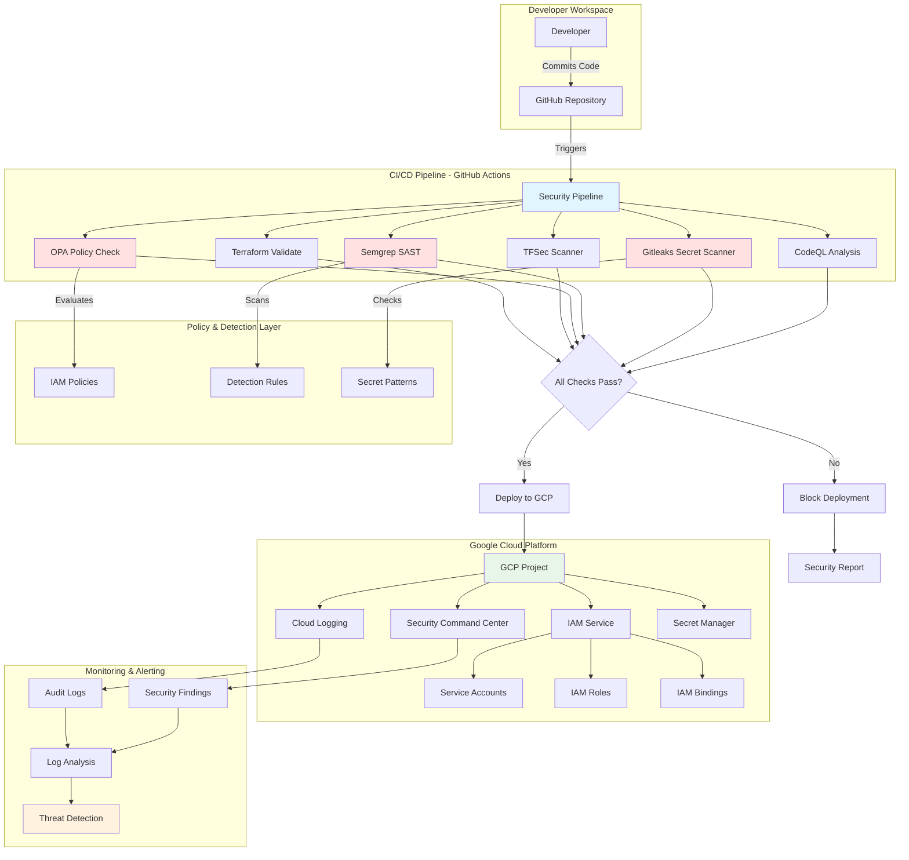

# GCP IAM Threat Detection Lab - Architecture

## System Architecture

This document provides a comprehensive overview of the GCP IAM Threat Detection Lab architecture.

## Architecture Diagram

## Component Descriptions

### CI/CD Pipeline
- **GitHub Actions**: Orchestrates the security pipeline
- **Terraform Validate**: Ensures IaC syntax correctness
- **TFSec**: Scans Terraform code for security issues
- **OPA**: Enforces policy-as-code rules
- **Semgrep**: Performs static application security testing
- **Gitleaks**: Detects hardcoded secrets
- **CodeQL**: Advanced code analysis

### GCP Infrastructure
- **IAM Service**: Manages identities and access
- **Cloud Logging**: Centralized log management
- **Security Command Center**: Security and risk management
- **Secret Manager**: Secure secret storage

### Security Controls
1. **Preventive**: Policy gates block insecure deployments
2. **Detective**: Continuous monitoring and alerting
3. **Corrective**: Automated remediation workflows

## Data Flow

1. Developer commits code to GitHub
2. GitHub Actions triggers security pipeline
3. Multiple security tools scan the code
4. OPA evaluates IAM policies against security rules
5. If all checks pass, changes deploy to GCP
6. GCP logs all IAM activities
7. Threat detection analyzes logs for anomalies
8. Security findings reported to SCC

## Security Layers

### Layer 1: Code Analysis
- Static code scanning
- Secret detection
- Dependency scanning

### Layer 2: Policy Enforcement
- Least privilege validation
- Role assignment checks
- Binding restrictions

### Layer 3: Runtime Detection
- Audit log monitoring
- Anomaly detection
- Behavioral analysis

## Key Features

- **Multi-stage Security Gates**: Multiple checkpoints before deployment
- **Policy as Code**: Automated enforcement of security policies
- **Detection as Code**: Codified threat detection rules
- **Continuous Monitoring**: Real-time security analysis
- **Audit Trail**: Complete logging of all activities
