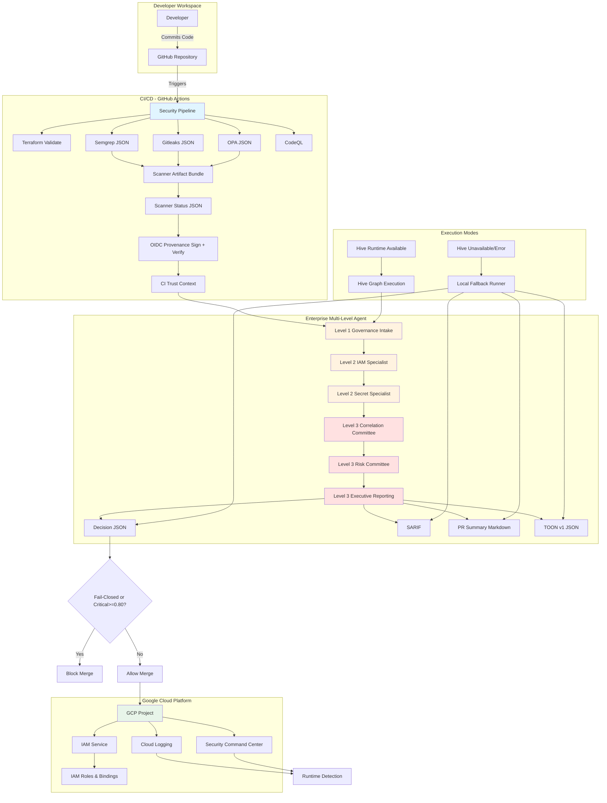

# GCP IAM Threat Detection Lab - Architecture

## System Architecture

This architecture uses a layered DevSecOps pipeline for GCP IAM, with an enterprise multi-level AI triage system implemented with Hive-compatible agent exports.

## Architecture Diagram

```mermaid
graph TB
    subgraph "Developer Workspace"
        A[Developer] -->|Commits Code| B[GitHub Repository]
    end

    subgraph "CI/CD - GitHub Actions"
        B -->|Triggers| C[Security Pipeline]
        C --> D[Terraform Validate]
        C --> E[Semgrep JSON]
        C --> F[Gitleaks JSON]
        C --> G[OPA JSON]
        C --> H[CodeQL]
        E --> I[Scanner Artifact Bundle]
        F --> I
        G --> I
        I --> I2[Scanner Status JSON]
        I2 --> I3[OIDC Provenance Sign + Verify]
        I3 --> I4[CI Trust Context]
    end

    subgraph "Enterprise Multi-Level Agent"
        I4 --> L1[Level 1 Governance Intake]
        L1 --> L2A[Level 2 IAM Specialist]
        L2A --> L2B[Level 2 Secret Specialist]
        L2B --> L3A[Level 3 Correlation Committee]
        L3A --> L3B[Level 3 Risk Committee]
        L3B --> L3C[Level 3 Executive Reporting]

        L3C --> J[Decision JSON]
        L3C --> K[SARIF]
        L3C --> M[PR Summary Markdown]
        L3C --> N2[TOON v1 JSON]
    end

    subgraph "Execution Modes"
        N[Hive Runtime Available] --> O[Hive Graph Execution]
        P[Hive Unavailable/Error] --> Q[Local Fallback Runner]
        O --> L1
        Q --> J
        Q --> K
        Q --> M
        Q --> N2
    end

    J --> R{Fail-Closed or Critical>=0.80?}
    R -->|Yes| S[Block Merge]
    R -->|No| T[Allow Merge]

    subgraph "Google Cloud Platform"
        U[GCP Project]
        U --> V[IAM Service]
        U --> W[Cloud Logging]
        U --> X[Security Command Center]
        V --> Y[IAM Roles & Bindings]
    end

    T --> U
    W --> Z[Runtime Detection]
    X --> Z

    style C fill:#e1f5ff
    style L1 fill:#fff3e0
    style L2A fill:#fff3e0
    style L2B fill:#fff3e0
    style L3A fill:#ffe1e1
    style L3B fill:#ffe1e1
    style L3C fill:#ffe1e1
    style U fill:#e8f5e9
```

## Component Descriptions

### CI/CD Pipeline
- **Terraform Validate**: validates IaC syntax and provider configuration.
- **Semgrep (JSON)**: static rule violations including IAM anti-patterns.
- **Gitleaks (JSON)**: secret and credential leakage detection.
- **OPA (JSON)**: policy-as-code outcomes for least privilege controls.
- **CodeQL**: repository-wide semantic code scanning.
- **Scanner Status**: machine-readable scanner integrity contract.
- **OIDC Provenance**: keyless signed provenance and identity verification.
- **CI Trust Context**: fork/non-fork policy and authn/authz context.

### Enterprise Multi-Level Agent (Hive Export)
- **Level 1 Governance Intake**: creates policy charter and output schema contract.
- **Level 2 IAM Specialist**: isolates IAM-specific risk (roles, bindings, public principals).
- **Level 2 Secret Specialist**: isolates key/token leakage and credential exposure risk.
- **Level 3 Correlation Committee**: deduplicates and prioritizes all specialist findings.
- **Level 3 Risk Committee**: applies merge-gate policy (`critical` and confidence `>= 0.80`).
- **Level 3 Executive Reporting**: outputs operator-ready summary for PR and audit trail.

### Execution Model
- **Primary**: Hive graph execution when framework runtime is available.
- **Fallback**: local enterprise runner preserving outputs (`decision`, `SARIF`, `markdown`, `TOON`) and policy semantics.

### Trust Boundary
- **Trusted boundary**: signed provenance + verified workflow identity + scanner integrity + CI context policy checks.
- **Fail-closed behavior**: if any trust/scanner/provenance check fails, merge is blocked independent of finding severity.

## Data Flow

1. Code changes trigger GitHub Actions.
2. Static scanners produce machine-readable artifacts.
3. Pipeline writes scanner integrity contract (`scanner-status.json`).
4. Pipeline signs and verifies provenance (`triage-provenance.*`) using GitHub OIDC keyless flow.
5. CI trust context is finalized (`ci-context.json`) with provenance status.
6. Enterprise agent ingests artifacts and applies multi-level analysis.
7. Committees output unified triage, governance decision, and executive summary.
8. Pipeline writes:
   - `ai-decision.json`
   - `ai-findings.sarif`
   - `ai-summary.md`
   - `ai-triage.toon.json`
9. Merge is blocked on fail-closed control failure OR `critical` findings meeting confidence threshold.
10. Approved changes proceed to GCP deployment and runtime monitoring.

## Contracts

### Environment Variables
- `OPENAI_API_KEY`: required for non-mock LLM execution.
- `AI_MODEL`: optional model override.
- `ENABLE_HIVE_ENTERPRISE_AGENT`: enables Hive-first execution (`true` by default).
- `HIVE_CORE_PATH`: optional path to Hive `core` for self-hosted runtime imports.
- `REQUIRE_SIGNED_PROVENANCE`: optional local strict mode (`true` forces signed provenance validation).

### Runner CLI Additions
- `--ci-context <path>`
- `--scanner-status <path>`
- `--toon-out <path>`
- `--require-signed-provenance`

### Normalized Finding Schema
- `source`
- `rule_id`
- `severity`
- `confidence`
- `file`
- `line`
- `evidence`
- `remediation`
- `category`

### Decision Additions
- `trust_validation`
- `scanner_integrity`
- `provenance_verified`
- `fail_closed`
- `execution_mode`

### TOON v1
- `schema: "toon.v1"`
- `token_table`: deterministic deduplicated token array
- `objects`: list of objects with `object_id`, `object_type`, and `pairs`
- `pairs`: `[key_token_index, value_token_index]`
- Includes one decision object and one object per finding

## Key Security Controls

1. **Preventive**: policy-gated merge with confidence-aware blocking.
2. **Detective**: multi-scanner evidence ingestion and specialist analysis lanes.
3. **Governance**: committee-based correlation and decision traceability.
4. **Verification**: signed provenance + trust-context validation.
5. **Corrective**: remediation-first outputs for developer execution.
